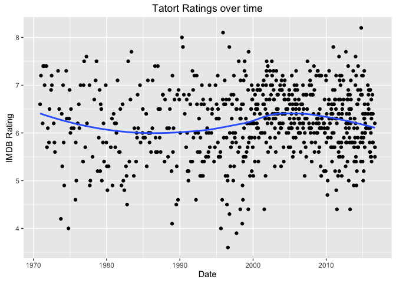

### Introduction

The German Tatort is a very popular crime series based in Germany,
Switzerland and Austria, which exists since 1970. Its concept is simple:
For 90 minutes, a group of investigators try to find the people
responsible for a murder or similar crime in a certain city. Despite
this seemingly easy concept, the series found itself being an elementary
part of typical german speaker's Sunday evening, with well over 10
million viewers in popular cities.

I also am a fan of the Tatort, so my questions were: Is there a
difference in popularity between german, austrian and swiss episodes?
Which investigative teams are the most popular? To answer these
questions, I downloaded IMDB ratings for each episode and aggregated the
data. This post will feature only the analysis, so for the data
generating code please head to my [GitHub
page](https://github.com/Stan125/tatoRt).

### Ratings over time

So how did ratings generally change over time? Lets find out:

    ggplot(wiki_table, aes(x = Erstausstrahlung, y = rating)) +
      geom_point() +
      geom_smooth(se = FALSE) +
      ggtitle("Tatort Ratings over time") +
      labs(y = "IMDB Rating", x = "Date")

